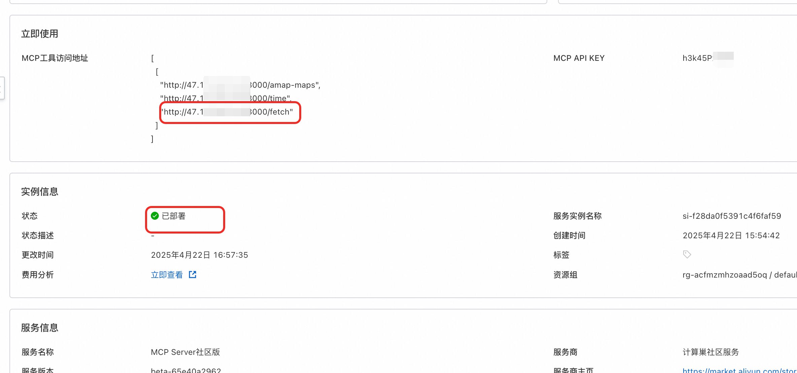
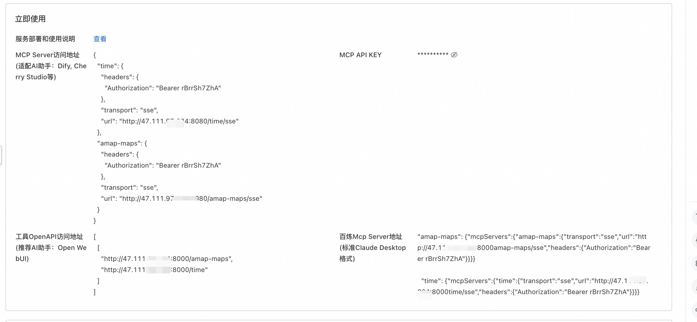
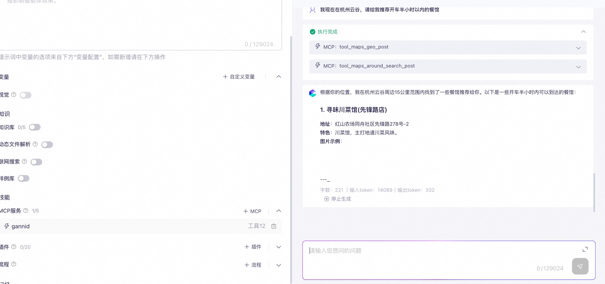

# MCP Server Deployment Documentation

## Overview

MCP (Model Context Protocol) is an open standard launched by Anthropic in late November 2024, aimed at unifying communication protocols between large language models (LLMs) and external data sources and tools. The main purpose of MCP is to solve the challenge of AI models not being able to fully realize their potential due to data silo limitations. MCP enables AI applications to safely access and operate on local and remote data, providing an interface for AI applications to connect with everything.

This service creatively solves the following problems in the traditional MCP market:
1. Only being able to select a single MCP tool for deployment at a time - This service supports deploying multiple MCP tools simultaneously
2. Inability to support both OpenAPI and SSE methods for tool invocation, which limits compatibility to only certain platforms - This service supports both invocation methods, compatible with Dify, Cherry Studio, OpenWebUI, and other AI assistants.
3. Lack of flexibility in adding or removing MCP tools - This service supports dynamically adding or removing MCP tools through configuration changes.

This document introduces how to activate the `MCP Server Community Edition` service on ComputeNest, as well as the deployment process and usage instructions.

## Prerequisites
<font style="color:rgb(51, 51, 51);">To deploy the Dify Community Edition service instance, you need access and creation permissions for certain Alibaba Cloud resources. Therefore, your account needs to include the following resource permissions.</font> **<font style="color:rgb(51, 51, 51);">Note</font>**<font style="color:rgb(51, 51, 51);">: These permissions are only required when your account is a RAM account.</font>

| <font style="color:rgb(51, 51, 51);">Permission Policy Name</font> | <font style="color:rgb(51, 51, 51);">Remarks</font> |
| --- | --- |
| <font style="color:rgb(51, 51, 51);">AliyunECSFullAccess</font> | <font style="color:rgb(51, 51, 51);">Permission to manage Elastic Compute Service (ECS)</font> |
| <font style="color:rgb(51, 51, 51);">AliyunVPCFullAccess</font> | <font style="color:rgb(51, 51, 51);">Permission to manage Virtual Private Cloud (VPC)</font> |
| <font style="color:rgb(51, 51, 51);">AliyunROSFullAccess</font> | <font style="color:rgb(51, 51, 51);">Permission to manage Resource Orchestration Service (ROS)</font> |
| <font style="color:rgb(51, 51, 51);">AliyunComputeNestUserFullAccess</font> | <font style="color:rgb(51, 51, 51);">User-side permission to manage ComputeNest service</font> |


The costs of MCP Server Community Edition on ComputeNest mainly involve:

- Selected vCPU and memory specifications
- System disk type and capacity
- Public network bandwidth

To improve the performance of MCP tool invocation, we recommend choosing at least 2 cores and 4GB or more of CPU.
By default, the network bandwidth is configured as 10Mbps, billed by traffic.

Billing methods include:

- Pay-as-you-go (hourly)
- Subscription (monthly/yearly)

The estimated cost can be viewed in real-time when creating an instance.
For more specifications or other services (such as cluster high availability requirements, enterprise support services, etc.), please contact us at [mailto:xx@xx.com](mailto:xx@xx.com).

## Deployment Architecture


## Deployment Process

### Deployment Parameter Description

| <font style="color:rgb(51, 51, 51);">Parameter Group</font> | <font style="color:rgb(51, 51, 51);">Parameter Item</font> | <font style="color:rgb(51, 51, 51);">Description</font> |
|------------------------------------------------------|--------------------------------------------------------|--------------------------------------------------------|
| <font style="color:rgb(51, 51, 51);">MCP Configuration</font> | <font style="color:rgb(51, 51, 51);">McpConfigJson</font> | <font style="color:rgb(51, 51, 51);">MCP tools to be used</font> |
|    | <font style="color:rgb(51, 51, 51);">MCP_KEY</font> | <font style="color:rgb(51, 51, 51);">Secret key for interaction between MCP Server and large models</font> |
| <font style="color:rgb(51, 51, 51);">Service Instance</font> | <font style="color:rgb(51, 51, 51);">Service Instance Name</font> | <font style="color:rgb(51, 51, 51);">Length not exceeding 64 characters, must start with an English letter, can contain numbers, English letters, hyphens (-) and underscores (_)</font> |
|                                                      | <font style="color:rgb(51, 51, 51);">Region</font> | <font style="color:rgb(51, 51, 51);">Region where the service instance is deployed</font> |
|                                                      | <font style="color:rgb(51, 51, 51);">Payment Type</font> | <font style="color:rgb(51, 51, 51);">Resource billing type: Pay-as-you-go or Subscription</font> |
| <font style="color:rgb(51, 51, 51);">ECS Instance Configuration</font> | <font style="color:rgb(51, 51, 51);">Instance Type</font> | <font style="color:rgb(51, 51, 51);">Instance specifications available in the availability zone</font> |
|                                                      | <font style="color:rgb(51, 51, 51);">Instance Password</font> | <font style="color:rgb(51, 51, 51);">Length 8-30, must include three types (uppercase letters, lowercase letters, numbers, special symbols from ()`~!@#$%^&*-+={}[]:;'<>,.?/)</font> |
| <font style="color:rgb(51, 51, 51);">Network Configuration</font> | <font style="color:rgb(51, 51, 51);">Availability Zone</font> | <font style="color:rgb(51, 51, 51);">Availability zone where the ECS instance is located</font> |
|                                                      | <font style="color:rgb(51, 51, 51);">VPC ID</font> | <font style="color:rgb(51, 51, 51);">VPC where the resource is located</font> |
|                                                      | <font style="color:rgb(51, 51, 51);">Switch ID</font> | <font style="color:rgb(51, 51, 51);">Switch where the resource is located</font> |

### Deployment Steps

1. Click the [deployment link]("https://computenest.console.aliyun.com/service/instance/create/default?type=user&ServiceName=MCP%20Server%E7%A4%BE%E5%8C%BA%E7%89%88"), enter the service instance deployment interface, select the region you want to deploy, and follow the interface prompts to fill in the parameters to complete the deployment.
2. Select the MCP tools you want to use. Note that you can select multiple tools! 
3. If you need to use custom MCP tools, please refer to [Using Custom MCP Tools]
4. There are two types of MCPs here. One type does not require environment variables, such as "Time Service", which you can simply check and skip the parameter configuration step.
5. The other type of MCP requires environment variables, such as Amap Maps, which requires configuring environment variables, otherwise MCP Server deployment will fail 
6. If you're not sure how to use an MCP tool, you can click "Help Documentation" to view and learn. 
7. The system has generated an API KEY by default to protect the MCP tools you are about to deploy; you can modify this parameter. 
8. Choose a package that suits you. For production environments, we recommend choosing specifications of at least 2 cores and 4GB. If deploying 3 or fewer MCP tools at a time, you can directly select the popular package. Configure the ECS login password.
9. If you want to select other instance types or public network bandwidth, you can choose a custom package for configuration.
10. Configure the availability zone and network. We recommend selecting any availability zone and then directly creating a new network and virtual machine 
11. Click "Create Now" and wait for the deployment to succeed. This process generally takes 3 minutes. The duration may vary depending on the number of tools you select. 
12. Access the newly deployed instance interface to view the address and API key of your dedicated MCP tools. Please refer to the following text for configuration and usage for different AI assistants.

### Using Custom MCP Tools
1. Click to add a custom MCP tool. Note: Custom MCP tools can be added repeatedly 
2. Fill in the name and ID of the custom tool. Note that the ID cannot be duplicated. 
3. Select the startup method for the MCP tool you want to use. If you select npx or uvx, you need to fill in the startup command, which should be in array form. For example:
    ```shell
    ['mcp-server-time', '--local-timezone=America/New_York']
    ```
4. If the command depends on some environment variables when starting, you need to fill them in below: such as key:GITHUB_PERSONAL_ACCESS_TOKEN, value: xxx
5. If you select the SSE startup method, you need to fill in the URL. Note: If authentication is required, the authentication key needs to be included in this URL. For example, "https://mcp-xxx-22b0-4037.api-inference.modelscope.cn/sse"
6. Click to select the current custom tool. 
   Note: Your newly added custom tools will be re-rendered during configuration changes, and you can add or reduce the MCP tools you want to use. When you have finished configuring custom MCP tools, you can continue with deployment step "6"

## Modifying MCP Tools to Use
If you want to modify the MCP tools to use, please refer to the following operations:
1. In the ComputeNest console, click "My Instances", select the previously deployed MCP Server instance, and click "Modify Configuration" in the upper right corner. 
2. Click to modify MCP tools and click "Next" 
3. Select the MCP tools you want to add, such as adding the Fetch tool in this example. (Note: Previously selected tools will be re-rendered here) 
4. Of course, if environment variables are involved, you must set them according to the documentation.
5. Click OK to initiate the tool modification request. 
6. Wait for the instance status to change. 
7. Add the newly added MCP tools from the output to your AI conversation client. 

## Cherry Studio Usage Example
1. Go to the ComputeNest instance interface,  the following operations require using the "MCP Server Access Address" section
2. Open your Cherry Studio assistant and create a new MCP server as shown in the example below. 
3. You can fill in any "Name" and description. Select "Server-Sent Events (SSE)" for the type.
5. For the URL, fill in the link from the instance interface shown here  Note that this uses the http protocol with an sse suffix at the end.
6. Add the authentication parameter in the request header: . Note that you need to change ":" to "=" when filling in, for example Authorization=Bearer 123
7. Click the enable button and save button in the upper right corner. 
8. Go to the conversation interface and select the MCP tools you want to use.
9. Select an appropriate model and talk to the AI, for example, "I'm in the great wall in Beijing city, please tell me some resturant which i can walk to there less 40 minutes", and the AI will use the model to help you find suitable restaurants.

## Dify Usage Example
1. Go to the ComputeNest instance interface,  the following operations require using the "MCP Server Access Address" section
2. Open your Dify and install "SSE Discovery and Invocation of MCP Tools" as shown in the example below 
3. If you encounter problems later, you can downgrade this tool version to 0.0.10. 
4. Click the "Authorize" button to configure the SSE tool. You can directly paste the MCP Server access address from step 1 here 
5. Create an Agent and enter it. 
6. As shown in the example below, enable MCP tool invocation, fill in appropriate prompts, and select a suitable model, such as QWEN-max. 
7. Start a conversation to invoke MCP tools. 


## Open WebUI Usage Example

1. Access the ComputeNest instance interface, 
2. Open your Open WebUI client, such as Open WebUI, and paste the address and API key. 
3. Create a new conversation and enable MCP tools 
4. Verify that the AI is using your MCP tools! 

## Troubleshooting

If you find that the instance is not successfully deployed, there's a 90% chance that the environment variables are configured incorrectly. You can refer to the following steps to troubleshoot:
1. Log in to the ECS instance through session management. 
2. Enter the following command to confirm if the environment variables are correct.
    ```shell
    cat /root/config.json
    ```
3. Modify the configuration. Restart the docker compose application

Please visit the MCP official documentation to learn how to use it: Usage Documentation