# Quickly build the MCP market within the enterprise-Function Compute Edition

With the deepening of enterprise digital transformation, Model Context Protocol (MCP), as an important bridge between AI models and enterprise data, is becoming the core infrastructure of enterprise AI applications. Alibaba Cloud Function Compute provides enterprises with more flexible and economical MCP market solutions, helping enterprises quickly build an internally privatized MCP service platform and realize unified management and distribution of AI capabilities. This article describes how to build an enterprise internal MCP market based on Function Compute, including system architecture design, public and private MCP service deployment, permission management, and enterprise-level functional features.

##1. Architecture Overview

### 1.1 Core Components

**Core Components:**

**MCP function management**: supports unified management of private and public MCP packages
**API Gateway (APIG)**: Provides unified API entry and routing control
**Permission Control Module**: API Key-based multi-tenant permission management
**Function Compute**: provides auto scaling and pay-as-you-go computing resources.

**Architectural Features:**

**Pay-as-you-go**: Function creation is free and only charged based on actual calls
**Auto Scaling**: Automatically scales the volume based on the requested volume.
**API Gateway Pay-As-You-Go**: supports flexible billing models
**Private MCP packages are stored through OSS**: supports localized deployment
**API Gateway provides a unified API access portal**: Unified authentication mechanism
**Complete monitoring and log management system**

### 1.2 Deployment Architecture

#### Enterprise Built-in MCP Platform Product Architecture-Function Compute Edition
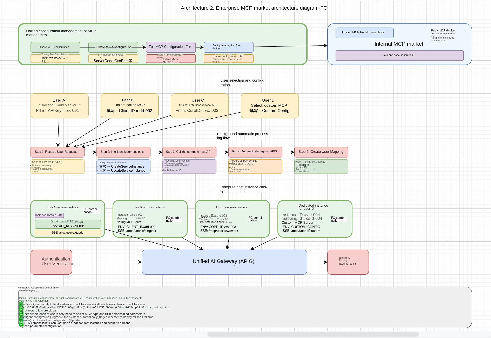

### 1.3 multi-protocol support
**Protocol Support:**

**MCP Native Protocol**:SSE long connection, real-time interaction

### 1.4 Deployment Mode

✅Rapid deployment of MCP functions, support for private deployment
✅Support function instance variable configuration and MCP debugging
✅Simple MCP dashboard

✅Support for selecting existing API Gateway instances and custom domain names
✅Enterprise Permission Management and API Key Distribution
✅Complete MCP Control Panel
✅Pay-As-You-Go flexible billing model

##2. prerequisites

To deploy an MCP Function Compute service instance, you need to access and create some Alibaba Cloud resources. Therefore, your account must contain permissions for the following resources. **Note**: This permission is required only when your account is a RAM account.

| Permission policy name | Comment |
| --- | --- |
| AliyunFCFullAccess | Permissions to manage Function Compute Service (FC) |
| AliyunVPCFullAccess | Permissions to manage a VPC |
| AliyunROSFullAccess | Manage permissions for Resource Orchestration Service (ROS) |
| AliyunComputeNestUserFullAccess | Manage user-side permissions for the compute nest service (ComputeNest) |
| AliyunAPIGatewayFullAccess | Manage permissions for API Gateway services |

##3. expose MCP service deployment

### 3.1 Expose MCP Service Types
The Function Compute MCP Marketplace supports several types of public MCP services:

**Standard Open MCP Tool:**

Browser automation tools
Location Services and Map Tools
Search Engine Tools
Developer Toolset
File Processing Tools
Data Analysis Tools

**Custom public MCP service:**

Support for NPX packages installed from public repositories
Support for UVX packages installed from public repositories
Existing SSE MCP service management

### 2.2 expose MCP service deployment process
#### 2.2.1 Rapid Deployment Steps
1. **Visit MCP Marketplace**
-Enter the calculation nest first click "MCP Market"
-Browse available public MCP tools

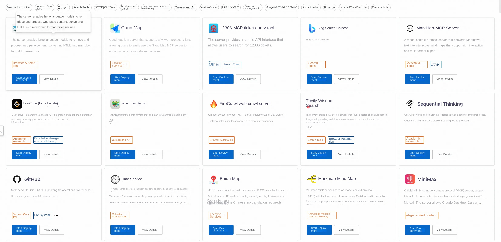

2. **Select MCP Tool**
-Select the MCP tool to deploy, such as "Bing Search Chinese"
-Click on the MCP tool to enter the detailed documentation interface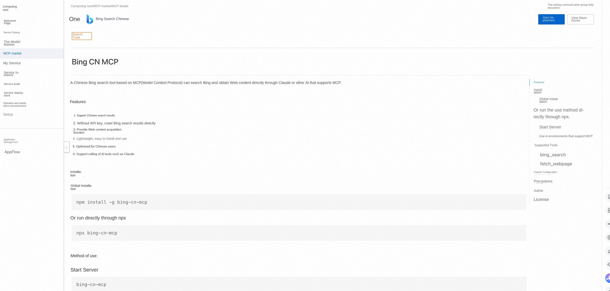
-View tool feature descriptions and usage examples
3. **Deployment Configuration**
-Click the "Deploy" button in the upper right corner
-Choose to create a new service instance or deploy to an existing instance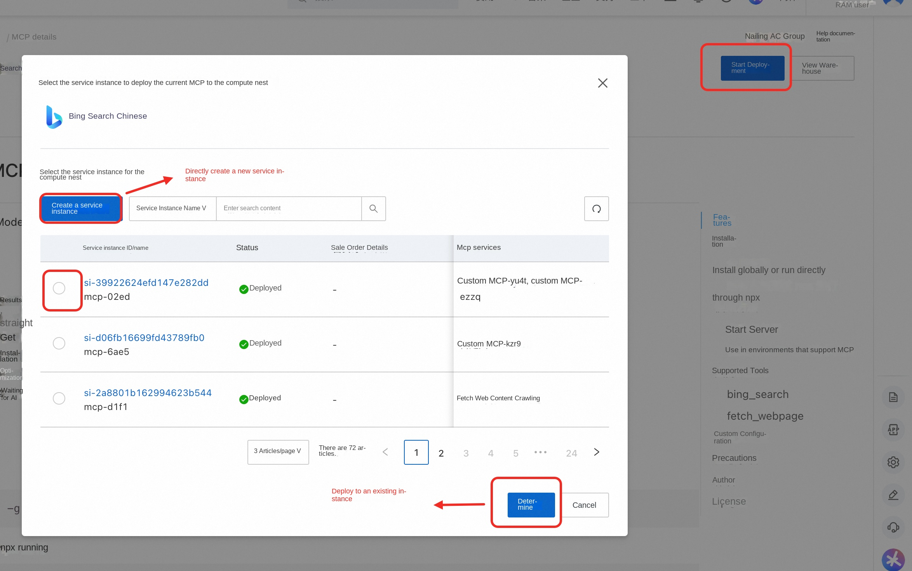
-Multiple MCP tools can be deployed within the same service instance
4. **Resource Allocation**
-Select existing or new gateway according to business situation
5. **Complete Deployment**
-Click "Create Now" to start deployment
-Wait for service instance creation to complete
-Get MCP console and debug interface access addresses

##3. private MCP service deployment
Note: If there is no available OSS bucket, we recommend that you create a computing nest service instance through any open MCP package first. The service instance will automatically create an OSS warehouse that meets the specifications.
To use an existing OSS bucket, perform the following steps to authorize:
1. Access the [OSS console](https://oss.console.aliyun.com/bucket)
2. Find the Bucket authorization policy.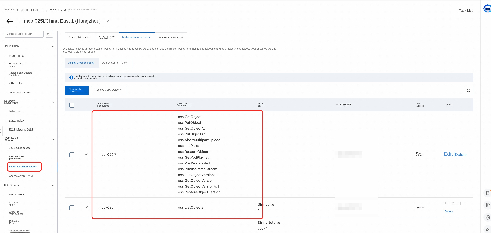
3. 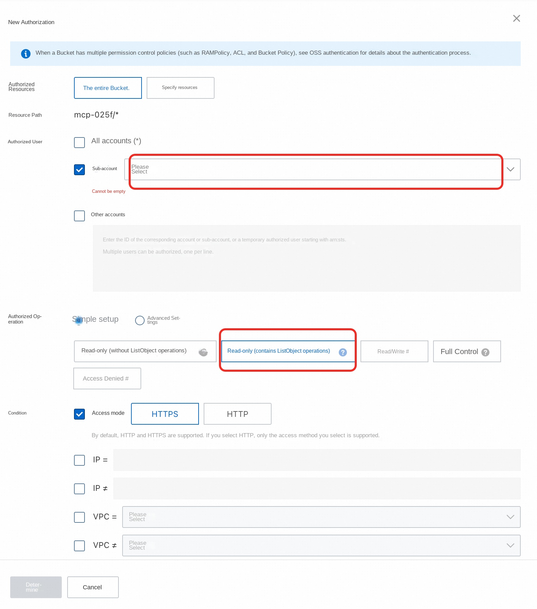
### 3.1 Supported MCP Formats
**For FC deployment, you must force zip compression and upload**
Computing Nest MCP Market supports standard package management formats:

**Python (UVX) format:**

Supported file types: '.whl',' .tar.gz'
pyproject.toml configuration based on [PEP 518 Standard](https://peps.python.org/pep-0518/)
Example warehouse:[https://github.com/aliyun-computenest/mcp-python-demo](https://github.com/aliyun-computenest/mcp-python-demo)

**JavaScript (NPX) format:**

Supported file type: '.tgz'
Standards-based package.json configuration
Example warehouse:[https://github.com/aliyun-computenest/mcp-js-demo](https://github.com/aliyun-computenest/mcp-js-demo)

### 3.2 the Python MCP package creation process
#### 3.2.1 Project Configuration
Create a compliant 'pyproject.toml' file:

''''toml
[build-system]
requires = ["hatchling"]
build-backend = "hatchling.build"

[project]
name = "your-mcp-package"# Package name (required)
version = "1.0.0"# Version number (required)
description = "Your MCP Server description"
authors = [
{name = "Your Name", email = "your.email@example.com"}
]
readme = "README.md"
requires-python = ">= 3.8" # Python version requirements
dependencies = []# runtime dependency

# Script entry point configuration (required)
[project.scripts]
your-mcp-command = "your_package_name.server:main"

[project.urls]
Homepage = "https://github.com/your-username/your-mcp-package"

# Build configuration
[tool.hatch.build.targets.wheel]
packages = ["src/your_package_name"]
'''

#### 3.2.2 Deployment steps

### Deployment parameter description

|  Parameter Group  |  Parameter Item  |  Description  |
| ------------------------------------------------------------------------------------- | ----------------------------------------------------------------------------------------------- |
| MCP configuration  | McpConfigJson | MCP tools to use MCP_KEY |  Key for MCP Server and Big Model Interaction  |
|  Service instance  |  Service instance name  |  It must be no more than 64 characters long and must start with a letter, can contain numbers, letters, dashes (-), and underscores (_) |
| |  Region  |  Region where the service instance is deployed  |
| |  Payment type  |  Resource billing type: Pay-As-You-Go and Monthly  |
| ECS instance configuration  |  instance type  |  Instance Password  |  is 8-30 in length and must contain three items (uppercase letters, lowercase letters, numbers, ()'~! @#$%^& *-+ = |{}[]:;'<>,.? Special symbols in/) |
|  Network Configuration  |  Zone  |  Zone where the ECS instance is located | VPC ID | VPC where the resource is located  |
| |  Switch ID |  Switch where the resource is located  |

1. **Visit Computing Nest MCP Market**
-Enter the home page of the calculation nest and click "MCP Market"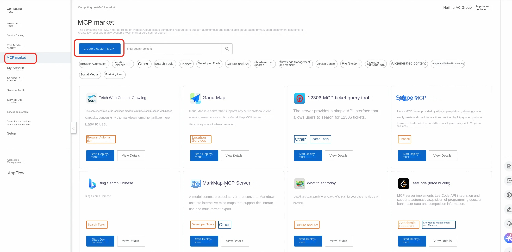
-Select "Create custom MCP"
2. **Basic information configuration**
-Upload MCP icon (support custom icon)
-Set MCP name and unique ID
-Note: The ID of the same service instance cannot be repeated.
3. **Package Upload Configuration**
-Select the installation method as "UVX"
-Select the appropriate region and OSS Bucket
-Upload packages in. whl or .tar.gz format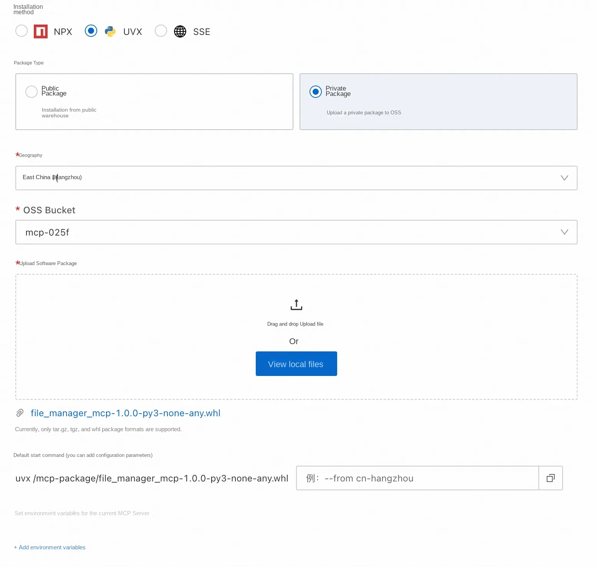
4. **Start parameter configuration**
-**Default Parameters**: The system automatically generates a startup command (cannot be modified).

'''bash
uvx /mcp-package/your-package-name.whl
'''

-**Custom Parameters**: You can add additional startup parameters

'''bash
--timezone Asia/Shanghai --config /path/to/config
'''

-**Environment Variables**: Set the environment variables required at runtime, such as API Key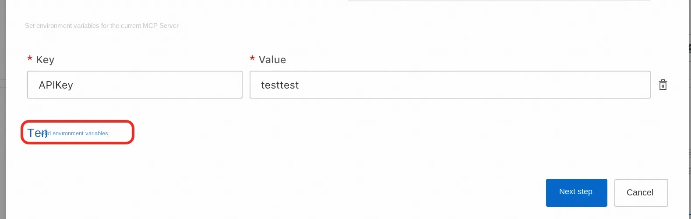
5. **Service Instance Deployment**
-**Create a new service instance** or **Deploy to an existing instance**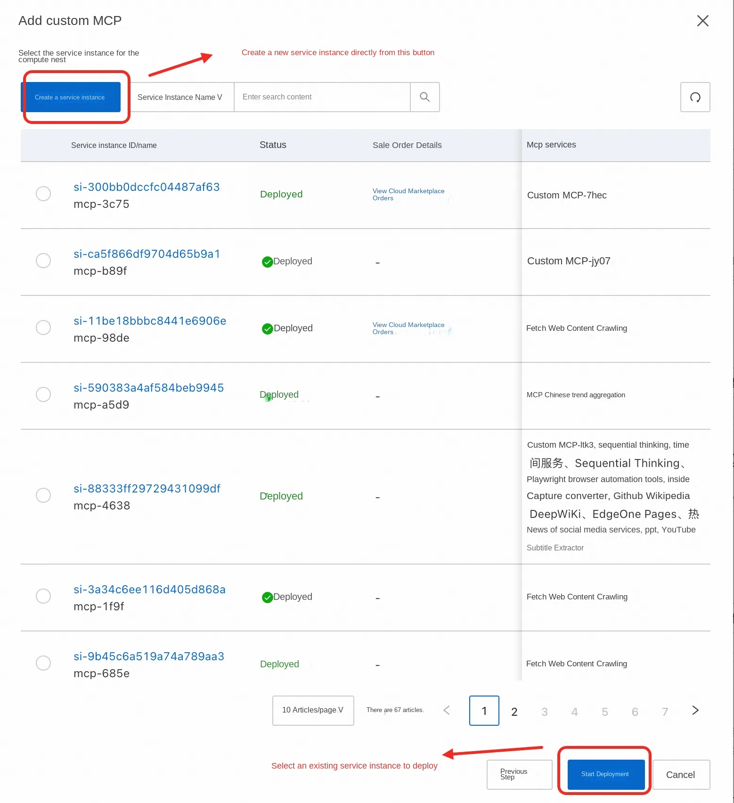
-Wait for the deployment to complete and check the service status through the MCP control platform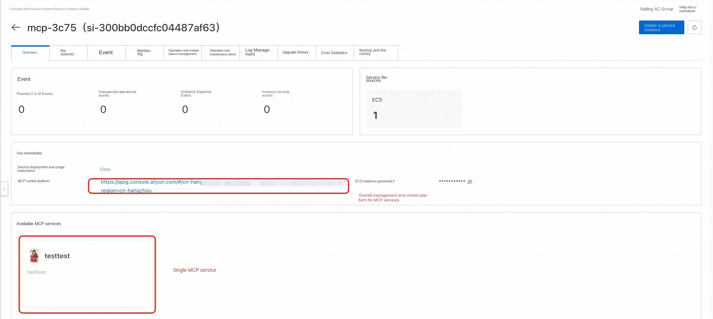

### 3.3 JavaScript MCP Package Creation Process
#### 3.3.1 Project Configuration
Make sure 'package.json' contains the correct configuration:

'''json
{
"name": "your-mcp-package ",
"version": "1.0.0 ",
"description": "Your MCP Server description ",
"main": "index.js ",
"bin ": {
"your-mcp-command": "./bin/server.js"
},
"dependencies ": {
"@modelcontextprotocol/sdk": "^0.4.0"
}
}
'''

#### 3.3.2 Deployment steps
1. **Package Format Preparation**
-Generate. tgz package file with 'npm pack'
2. **Upload Configuration**
-Select the installation method as "NPX"
-Upload packages in. tgz format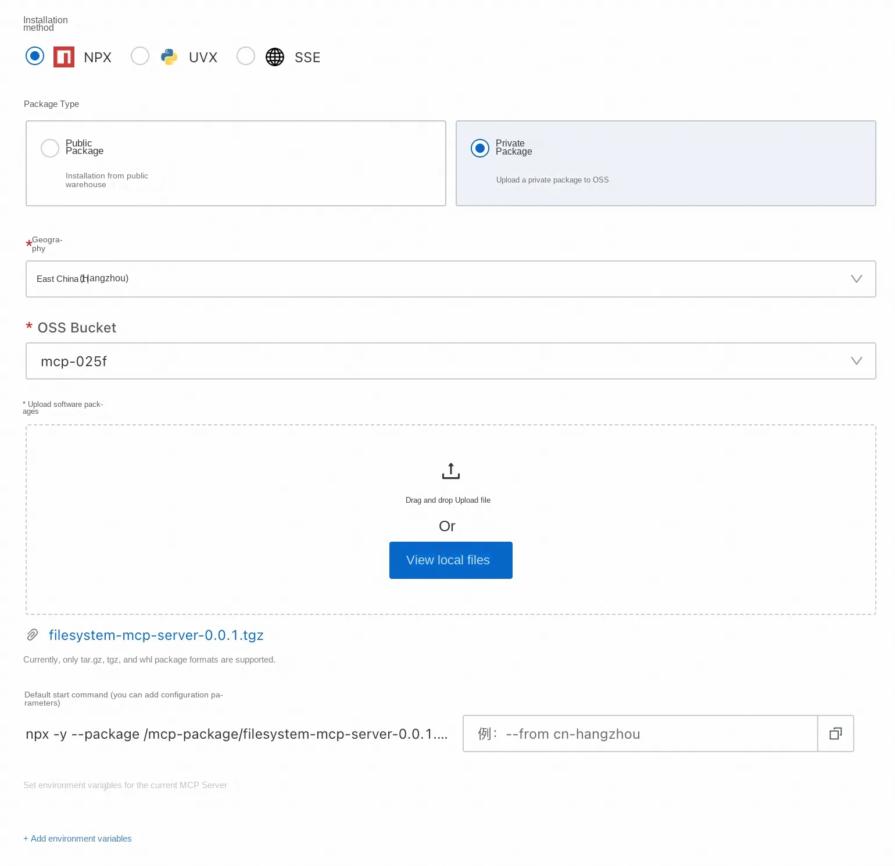
3. **Start parameter configuration**
-**Default Parameters**:

'''bash
npx -y -- package /mcp-package/your-package.tgz ${start command}
'''

-**Custom parameter**: The first parameter must be an executable file map (package the value of the bin field in. json)
1. If the user has a custom parameter item, such as setting the time zone for the package, he can pass in a value similar to the -- from cn-beijing to set it. Incoming instructions are parsed here with spaces

'''bash
your-mcp-command --config /path/to/config
'''

4. * * Environment variables: * * If you need to set environment variables for the package of MCP Server, such as API Key of Gaud Map, you can set them here. Click Next after setting
5. **Create a new service instance directly** Or **Select an existing service instance**
1. If you want to create a service instance directly through the configuration **just now, click Create Service Instance in the upper left corner of the page.
2. If you want to deploy the MCP directly to **Existing Service Instance**, select a service instance below and click Start Deployment

6. After the service instance is deployed, you can click the MCP control platform to view the overall MCP service, or select one of the available MCP services below to view:

### 3.4 Private MCP Package Management
#### 3.4.1 Package Storage Mechanism
**OSS storage scheme:**

All private packages are uploaded to the user's own OSS bucket root directory

**Security Control:**

Secure OSS access through FC RAM Role
Supports encrypted storage of packages
Implement access logs and audits

#### 3.4.2 Package Deployment Process
**Automated deployment process:**

1. **Environment check**: Check whether the OSSUtil tool has been installed and configured
2. **Package Download**: Download the private MCP package from OSS to the local
3. **Service Startup**: Starts the MCP service as configured
4. **Health Check**: Verify that the service is running properly
5. **Service Registration**: Register the service to the AI gateway

##4. enterprise internal API to MCP service

### 4.1 API to MCP Adapter
For the internal API service of the enterprise, the existing API can be converted to MCP based on API gateway.

**Applicable scenario:**

Enterprise internal API services
Profile to meet OpenAPI specifications
Existing services that need to be converted to the MCP protocol

**Conversion ability:**

Support for batch conversion of OpenAPI specifications to MCP Server
Automatic generation of MCP protocol adaptation layer
Keep the functionality and performance of the original API

##5. Enterprise Access Guide

### 5.1 Enterprise Permission Management Architecture
**The Permission Control module contains the following core components:**

**Consumer Management (Consumer Management)**: Manage identities for different business teams
**API Key Authentication**: API Key-based authentication mechanism
**Authorization Policy Engine**: Control consumer access to MCP services
**Route-level permission control**: implements fine-grained route access control at the API gateway level

### 5.2 Consumer and API Key Management

#### 5.2.1 Consumer Creation Process
The platform administrator creates a consumer identity for the business team by calling the 'CreateConsumer' API:

**API call example:**

'''json
{
"apiKeyIdentityConfig ": {
"apikeySource ": {
"source": "QueryString ",
"value": "apikey"
},
"type": "Apikey ",
"credentials ": [
{
"generateMode": "Custom ",
"apikey": "bmw-team-a-001"
}
]
},
"name": "Accounting Team",
"enable": true
"gatewayType": "AI"
}
'''

### 5.3 MCP Service Authorization Mechanism

#### 5.3.1 Enable MCP Service Authentication
To enable the authentication mechanism for each MCP service, call the 'CreateAndAttachPolicy' API:

'''json
{
"attachResourceType": "GatewayRoute ",
"gatewayId": "gw-d1qbbium1hko66pmepf0 ",
"environmentId": "env-d1qbc7em1hkluu4lgagg ",
"config": "{\"authenticationType\":\"Apikey\",\"enable\":true} ",
"className": "Authentication ",
"attachResourceIds ": [
"hr-d1sqdqem1hkrte7kn3t0"
]
}
'''

##6. MCP service usage and integration

### 6.1 AI Assistant Integration

#### 6.1.1 Cherry Studio Integration Example
**Configuration steps:**

1. **Obtain MCP configuration information**
-access the function compute instance interface
-Select the MCP tool to use to go to the details page
-Copy MCP server configuration information

2. **Configure Cherry Studio**
-Open Cherry Studio Assistant
-New MCP Server Configuration
-Paste configuration information copied from the console
-If the authentication parameter is not automatically identified, you need to manually copy the API Key

3. **Enable and Use**
-Click "Enable" and "Save" in the upper right corner"
-Enter the dialogue interface and select the MCP tool to use
-Start a conversation with the AI assistant to invoke the MCP tool function

## 7, operation and maintenance monitoring

### 7.1 Function Compute Monitoring

#### 7.1.1 Monitoring Indicators
**Function Compute monitoring metrics:**

Number of function calls and success rate
Function execution time and memory usage
Error Rate and Anomaly Statistics
Concurrency and current limiting

**API Gateway monitoring metrics:**

API call volume and response time
Error code distribution and success rate
Flow Peak and Current Limit Statistics

#### 7.1.2 Cost Optimization
**Function Compute Cost Advantage:**

**Pay As You Need**: Pay for actual execution time only
**Auto Scaling**: Automatically adjusts resources based on the requested volume
**Serverless architecture**: No need to manage the underlying infrastructure
**Reserved Instances**: Reserved Instances can be used to reduce costs for high-frequency calling scenarios

**Cost optimization recommendations:**

Set function memory specifications reasonably
Optimizing Function Code Execution Efficiency
Use Reserved Instances to handle steady traffic
Monitor and analyze cost usage

##8. Function Compute Version Advantages

### 8.1 Cost Advantage
**Create free**: Function creation does not incur fees.
**Pay-as-you-go**: Charges only based on actual calls
**API Gateway Pay-As-You-Go**: flexible billing model
**No prepaid**: Avoid wasting resources

### 8.2 technical advantages
**Auto Scaling**: Automatically scales the volume according to the requested volume.
**High Availability**: Multi-zone deployment, automatic failover
**Rapid deployment**: second-level startup, quick response
**Operations Simplified**: No need to manage servers and runtime environments

### 8.3 applicable scenario
**SMEs**: Cost sensitive, need flexible billing
**Volatility Business**: Scenarios with unstable request volume
**Rapid Prototyping**: Requires rapid validation and deployment
**Microservice architecture**: suitable for splitting into independent function services

##10. Q & A

**Q: What is the difference between the Function Compute version and the ECS version?**

A: The main difference is:
-**Billing Mode**: Function Compute pays by call volume, ECS pays by instance duration
-**O & M Complexity**: Function Compute does not need to manage the server. ECS needs O & M management
-**Auto Scaling**: Function Compute automatically scales. You need to manually or configure auto scaling for ECS instances.
-**Applicable scenario**: Function Compute is suitable for volatile businesses, and ECS is suitable for stable and high-load businesses.

