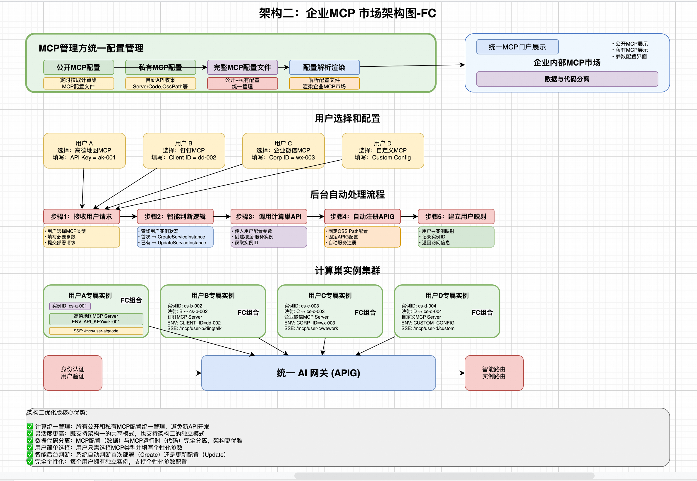
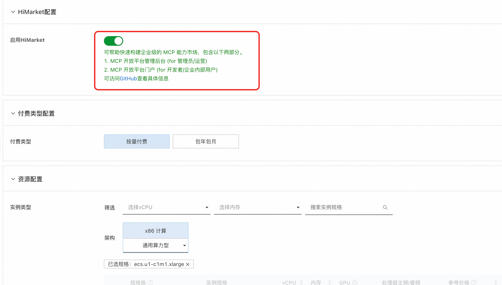

我已经学习了这个关于企业内部MCP市场的详细文档。现在我来为您提供一个基于函数计算（FC）版本的文档：

# 快速打造企业内部的MCP市场 - 函数计算版

随着企业数字化转型的深入，Model Context Protocol (MCP) 作为连接AI模型与企业数据的重要桥梁，正在成为企业AI应用的核心基础设施。阿里云函数计算为企业提供了更加灵活、经济的MCP市场解决方案，帮助企业快速构建内部私有化的MCP服务平台，实现AI能力的统一管理和分发。本文介绍如何基于函数计算构建企业内部MCP市场，包括系统架构设计、公开和私有MCP服务部署、权限管理以及企业级功能特性。

## 一、架构概述

### 1.1 核心组件

**核心组件：**

+ **MCP函数管理**：支持私有和公开MCP包的统一管理
+ **API网关（APIG）**：提供统一的API入口和路由控制
+ **权限控制模块**：基于API Key的多租户权限管理
+ **函数计算服务**：提供弹性伸缩、按需付费的计算资源

**架构特点：**

+ **按需付费**：函数创建免费，仅根据实际调用量收费
+ **弹性伸缩**：自动根据请求量进行扩缩容
+ **API网关按量付费**：支持灵活的计费模式
+ **私有MCP包通过OSS存储**：支持本地化部署
+ **API网关提供统一的API访问入口**：统一认证机制
+ **完整的监控和日志管理体系**

### 1.2 部署架构

#### 企业内建MCP平台产品架构 - 函数计算版


### 1.3 多协议支持
**协议支持：**

+ **MCP原生协议**：SSE长连接，实时交互


### 1.4 部署模式

+ ✅ 快速部署MCP函数，支持私有化部署
+ ✅ 支持函数实例变配和MCP调试
+ ✅ 简单的MCP管控面板

+ ✅ 支持选择已有API网关实例和自定义域名
+ ✅ 企业级权限管理和API Key分发
+ ✅ 完备的MCP管控面板
+ ✅ 按量付费的灵活计费模式

## 二、前提条件

部署MCP函数计算版服务实例，需要对部分阿里云资源进行访问和创建操作。因此您的账号需要包含如下资源的权限。**说明**：当您的账号是RAM账号时，才需要添加此权限。

| 权限策略名称 | 备注 |
| --- | --- |
| AliyunFCFullAccess | 管理函数计算服务（FC）的权限 |
| AliyunVPCFullAccess | 管理专有网络（VPC）的权限 |
| AliyunROSFullAccess | 管理资源编排服务（ROS）的权限 |
| AliyunComputeNestUserFullAccess | 管理计算巢服务（ComputeNest）的用户侧权限 |
| AliyunAPIGatewayFullAccess | 管理API网关服务的权限 |

## 三、公开MCP服务部署

### 3.1 公开MCP服务类型
函数计算MCP市场支持多种类型的公开MCP服务：

**标准公开MCP工具：**

+ 浏览器自动化工具
+ 位置服务和地图工具
+ 搜索引擎工具
+ 开发者工具集
+ 文件处理工具
+ 数据分析工具

**自定义公开MCP服务：**

+ 支持从公共仓库安装的NPX包
+ 支持从公共仓库安装的UVX包
+ 已有的SSE MCP服务纳管

### 2.2 公开MCP服务部署流程
#### 2.2.1 快速部署步骤
1. **访问MCP市场**
    - 进入计算巢首点击"MCP市场"
    - 浏览可用的公开MCP工具


2. **选择MCP工具**
    - 选择要部署的MCP工具，如"必应搜索中文"
    - 点击MCP工具进入详细文档界面
    - 查看工具功能说明和使用示例
3. **部署配置**
    - 点击右上角的"部署"按钮
    - 选择创建新的服务实例或部署到已有实例
    - 多个MCP工具可部署在同一服务实例内
4. **资源配置**
    - 根据业务情况选择已有或新建的网关
5. **完成部署**
    - 点击"立即创建"开始部署
    - 等待服务实例创建完成
    - 获取MCP控制台和调试界面访问地址

## 三、私有MCP服务部署
注意：如果无可用的OSS Bucket建议先通过任意公开MCP包创建出计算巢服务实例，该服务实例会自动创建出符合规范的OSS仓库。
如需要使用已有的OSS Bucket，可参考以下步骤进行授权：
1. 访问[OSS控制台](https://oss.console.aliyun.com/bucket)
2. 找到Bucket授权策略。
3. 
### 3.1 支持的MCP格式
**对于FC的部署方式，必须强制进行zip压缩后上传**
计算巢MCP市场支持标准的包管理格式：

**Python (UVX) 格式：**

+ 支持文件类型：`.whl`、`.tar.gz`
+ 基于[PEP 518标准](https://peps.python.org/pep-0518/)的pyproject.toml配置
+ 示例仓库：[https://github.com/aliyun-computenest/mcp-python-demo](https://github.com/aliyun-computenest/mcp-python-demo)

**JavaScript (NPX) 格式：**

+ 支持文件类型：`.tgz`
+ 基于标准的package.json配置
+ 示例仓库：[https://github.com/aliyun-computenest/mcp-js-demo](https://github.com/aliyun-computenest/mcp-js-demo)

### 3.2 Python MCP包创建流程
#### 3.2.1 项目配置
创建符合标准的`pyproject.toml`文件：

```toml
[build-system]
requires = ["hatchling"]
build-backend = "hatchling.build"

[project]
name = "your-mcp-package"           # 包名（必需）
version = "1.0.0"                   # 版本号（必需）
description = "Your MCP Server description"
authors = [
    {name = "Your Name", email = "your.email@example.com"}
]
readme = "README.md"
requires-python = ">=3.8"          # Python版本要求
dependencies = []                   # 运行时依赖

# 脚本入口点配置（必需）
[project.scripts]
your-mcp-command = "your_package_name.server:main"

[project.urls]
Homepage = "https://github.com/your-username/your-mcp-package"

# 构建配置
[tool.hatch.build.targets.wheel]
packages = ["src/your_package_name"]
```

#### 3.2.2 部署步骤


### 部署参数说明

| <font style="color:rgb(51, 51, 51);">参数组</font>     | <font style="color:rgb(51, 51, 51);">参数项</font>         | <font style="color:rgb(51, 51, 51);">说明</font>                                            |
|-----------------------------------------------------|---------------------------------------------------------|-------------------------------------------------------------------------------------------|
| <font style="color:rgb(51, 51, 51);">MCP配置</font>   | <font style="color:rgb(51, 51, 51);">McpConfigJson</font>  | <font style="color:rgb(51, 51, 51);">需要使用的MCP工具</font>                                    |
|    | <font style="color:rgb(51, 51, 51);">MCP_KEY</font> | <font style="color:rgb(51, 51, 51);">MCP Server和大模型交互的秘钥</font>                           |
| <font style="color:rgb(51, 51, 51);">服务实例</font>    | <font style="color:rgb(51, 51, 51);">服务实例名称</font>      | <font style="color:rgb(51, 51, 51);">长度不超过64个字符，必须以英文字母开头，可包含数字、英文字母、短划线（-）和下划线（_）</font> |
|                                                     | <font style="color:rgb(51, 51, 51);">地域</font>          | <font style="color:rgb(51, 51, 51);">服务实例部署的地域</font>                                     |
|                                                     | <font style="color:rgb(51, 51, 51);">付费类型</font>        | <font style="color:rgb(51, 51, 51);">资源的计费类型：按量付费和包年包月</font>                             |
| <font style="color:rgb(51, 51, 51);">ECS实例配置</font> | <font style="color:rgb(51, 51, 51);">实例类型</font>        | <font style="color:rgb(51, 51, 51);">可用区下可以使用的实例规格</font>                                 |
|                                                     | <font style="color:rgb(51, 51, 51);">实例密码</font>        | <font style="color:rgb(51, 51, 51);">长度8-30，必须包含三项（大写字母、小写字母、数字、 ()`~!@#$%^&*-+=          |{}[]:;'<>,.?/ 中的特殊符号）</font> |
| <font style="color:rgb(51, 51, 51);">网络配置</font>    | <font style="color:rgb(51, 51, 51);">可用区</font>         | <font style="color:rgb(51, 51, 51);">ECS实例所在可用区</font>                                    |
|                                                     | <font style="color:rgb(51, 51, 51);">VPC ID</font>      | <font style="color:rgb(51, 51, 51);">资源所在VPC</font>                                       |
|                                                     | <font style="color:rgb(51, 51, 51);">交换机ID</font>       | <font style="color:rgb(51, 51, 51);">资源所在交换机</font>                                       |

1. **访问计算巢MCP市场**
    - 进入计算巢首页，点击"MCP市场"
    - 选择"创建自定义MCP"
2. **基础信息配置**
    - 上传MCP图标（支持自定义图标）
    - 设置MCP名称和唯一ID
    - 注意：同一服务实例下ID不能重复
3. **包上传配置**
    - 选择安装方式为"UVX"
    - 选择合适的地域和OSS Bucket
    - 上传.whl或.tar.gz格式的软件包
4. **启动参数配置**
    - **默认参数**：系统自动生成启动命令（不可修改）

```bash
uvx /mcp-package/your-package-name.whl
```

    - **自定义参数**：可添加额外的启动参数

```bash
--timezone Asia/Shanghai --config /path/to/config
```

    - **环境变量**：设置运行时需要的环境变量，如API Key等
5. **服务实例部署**
    - **选择创建新的服务实例** 或 **部署到已有实例**
    - 等待部署完成，通过MCP管控平台查看服务状态

### 3.3 JavaScript MCP包创建流程
#### 3.3.1 项目配置
确保`package.json`包含正确的配置：

```json
{
  "name": "your-mcp-package",
  "version": "1.0.0",
  "description": "Your MCP Server description",
  "main": "index.js",
  "bin": {
    "your-mcp-command": "./bin/server.js"
  },
  "dependencies": {
    "@modelcontextprotocol/sdk": "^0.4.0"
  }
}
```

#### 3.3.2 部署步骤
1. **包格式准备**
    - 使用`npm pack`生成.tgz包文件
2. **上传配置**
    - 选择安装方式为"NPX"
    - 上传.tgz格式的软件包
3. **启动参数配置**
    - **默认参数**：

```bash
npx -y --package /mcp-package/your-package.tgz ${启动命令}
```

    - **自定义参数**：第一个参数必须是可执行文件映射（package.json中bin字段的值）
    1. 用户如果有自定义参数项，比如给package设置时区，则可传入类似--from cn-beijing的值进行设置。此处会通过空格解析传入的指令

```bash
your-mcp-command --config /path/to/config
```

4. **环境变量：**如果您使用的MCP Server的package需要设置环境变量，比如高德地图的API Key，则可在此处设置。设置完后点击下一步
5. **直接新建服务实例** Or **选择已有的服务实例**
    1. 如果想通过刚刚的配置**直接创建服务实例**，则选择界面左侧上方的“创建服务实例”按钮。
    2. 如果想将该MCP直接部署到“**已有的服务实例**”，则在下方选择某个服务实例，并点击开始部署


6. 待服务实例部署完后，可点击MCP管控平台查看整体的MCP服务，或在下方可用的MCP服务处选择某一个来查看：


### 3.4 私有MCP包管理
#### 3.4.1 包存储机制
**OSS存储方案：**

+ 所有私有包统一上传到用户自有的OSS Bucket根目录

**安全控制：**

+ 通过FC RAM Role实现安全的OSS访问
+ 支持包的加密存储
+ 实施访问日志和审计

#### 3.4.2 包部署流程
**自动化部署流程：**

1. **环境检查**：检查OSSUtil工具是否已安装配置
2. **包下载**：从OSS下载私有MCP包到本地
3. **服务启动**：根据配置启动MCP服务
4. **健康检查**：验证服务是否正常运行
5. **服务注册**：将服务注册到AI网关


## 四、企业内部API转MCP服务

### 4.1 API转MCP适配器
对于企业内部的API服务，可基于API网关实现已有API转MCP。

**适用场景：**

+ 企业内部API服务
+ 满足OpenAPI规范的配置文件
+ 需要转换为MCP协议的现有服务

**转换能力：**

+ 支持将OpenAPI规范批量转化为MCP Server
+ 自动生成MCP协议适配层
+ 保持原有API的功能和性能

## 五、企业接入指南

### 基于HiMarket
可通过计算巢部署一键拉起HiMarket


使用可参考官网文档https://github.com/higress-group/himarket

### 5.1.2 企业级权限管理架构
**权限控制模块包含以下核心组件：**

+ **消费者管理（Consumer Management）**：管理不同业务团队的身份标识
+ **API Key认证**：基于API Key的身份验证机制
+ **授权策略引擎**：控制消费者对MCP服务的访问权限
+ **路由级权限控制**：在API网关层面实现精细化的路由访问控制

### 5.1.2 示例
可参考部署架构如下所示：


角色分为：
1. MCP管理方：只维护网关和MCP包的配置。不实际去部署MCP实例。
2. 企业用户：使用MCP时需要配置上该MCP需要的环境变量。比如高德APIkey。
   搭建流程：
1. MCP管理方自己维护完整的MCP配置，包含（公开+私有MCP配置）
   a. 公开：可定时拉取计算巢侧的MCP配置文件
   b. 私有：可自行开发API收集内部的MCP配置，保存好诸如ServerCode，OssPath等私有MCP配置。
2. 通过解析第一步的完整配置文件，渲染出企业内部的MCP市场。此处开源给出前端简单的Demo
3. 通过配置结合计算巢[CreateServiceInstance](https://help.aliyun.com/zh/compute-nest/developer-reference/api-computenestsupplier-2021-05-21-createserviceinstance?spm=a2c4g.11174283.help-menu-search-268599.d_1)接口实现用户的MCP实例创建
   使用流程：
1. 用户选择要使用的MCP类型，填写参数。
2. （后台动作）调用计算巢 创建服务实例Or更新服务实例 创建出新的MCP。
   a. 在该过程中，OSS Path，APIG为固定配置。计算巢实例创建过程中会自动将新的MCP注册到APIG。
   b. （后台动作）平台将用户和该计算巢实例对应。单个用户对应-单个服务实例
3. （后台动作）通过实例ID查询拥有的MCP
4. 返回到MCP列表页面
5. 用户使用MCP

优势：
1. 灵活度更高。架构一的方式也支持
2. 实现上更优雅：数据（MCP配置）和代码分离（MCP运行时）

### 5.2 消费者与API Key管理

#### 5.2.1 消费者创建流程
平台管理员通过调用`CreateConsumer` API为业务团队创建消费者身份：

**API调用示例：**

```json
{
  "apiKeyIdentityConfig": {
    "apikeySource": {
      "source": "QueryString",
      "value": "apikey"
    },
    "type": "Apikey",
    "credentials": [
      {
        "generateMode": "Custom",
        "apikey": "bmw-team-a-001"
      }
    ]
  },
  "name": "会计团队",
  "enable": true,
  "gatewayType": "AI"
}
```

### 5.3 MCP服务授权机制

#### 5.3.1 启用MCP服务认证
为每个MCP服务启用认证机制，调用`CreateAndAttachPolicy` API：

```json
{
  "attachResourceType": "GatewayRoute",
  "gatewayId": "gw-d1qbbium1hko66pmepf0",
  "environmentId": "env-d1qbc7em1hkluu4lgagg",
  "config": "{\"authenticationType\":\"Apikey\",\"enable\":true}",
  "className": "Authentication",
  "attachResourceIds": [
    "hr-d1sqdqem1hkrte7kn3t0"
  ]
}
```

## 六、MCP服务使用与集成

### 6.1 AI助手集成

#### 6.1.1 Cherry Studio集成示例
**配置步骤：**

1. **获取MCP配置信息**
    - 访问函数计算实例界面
    - 选择要使用的MCP工具进入详情页面
    - 复制MCP服务器配置信息

2. **配置Cherry Studio**
    - 打开Cherry Studio助手
    - 新建MCP服务器配置
    - 粘贴从控制台复制的配置信息
    - 如果鉴权参数未自动识别，需要手动复制API Key

3. **启用和使用**
    - 点击右上角的"启用"和"保存"
    - 进入对话界面，选择要使用的MCP工具
    - 开始与AI助手进行对话，调用MCP工具功能

## 7、运维监控

### 7.1 函数计算监控

#### 7.1.1 监控指标
**函数计算监控指标：**

+ 函数调用次数和成功率
+ 函数执行时长和内存使用
+ 错误率和异常统计
+ 并发度和限流情况

**API网关监控指标：**

+ API调用量和响应时间
+ 错误码分布和成功率
+ 流量峰值和限流统计

#### 7.1.2 成本优化
**函数计算成本优势：**

+ **按需付费**：仅为实际执行时间付费
+ **自动伸缩**：根据请求量自动调整资源
+ **无服务器架构**：无需管理底层基础设施
+ **预留实例**：对于高频调用场景可使用预留实例降低成本

**成本优化建议：**

+ 合理设置函数内存规格
+ 优化函数代码执行效率
+ 使用预留实例处理稳定流量
+ 监控和分析成本使用情况

## 八、函数计算版本优势

### 8.1 成本优势
+ **创建免费**：函数创建不产生费用
+ **按量付费**：仅根据实际调用量收费
+ **API网关按量付费**：灵活的计费模式
+ **无需预付费**：避免资源浪费

### 8.2 技术优势
+ **弹性伸缩**：自动根据请求量扩缩容
+ **高可用性**：多可用区部署，故障自动切换
+ **快速部署**：秒级启动，快速响应
+ **运维简化**：无需管理服务器和运行时环境

### 8.3 适用场景
+ **中小企业**：成本敏感，需要灵活计费
+ **波动性业务**：请求量不稳定的场景
+ **快速原型**：需要快速验证和部署
+ **微服务架构**：适合拆分为独立的函数服务

## 十、Q&A

**Q: 函数计算版本与ECS版本有什么区别？**

A: 主要区别在于：
- **计费模式**：函数计算按调用量付费，ECS按实例时长付费
- **运维复杂度**：函数计算无需管理服务器，ECS需要运维管理
- **弹性伸缩**：函数计算自动伸缩，ECS需要手动或配置自动伸缩
- **适用场景**：函数计算适合波动性业务，ECS适合稳定高负载业务


