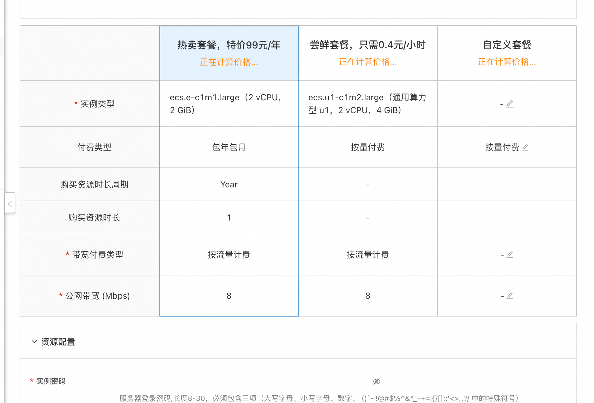
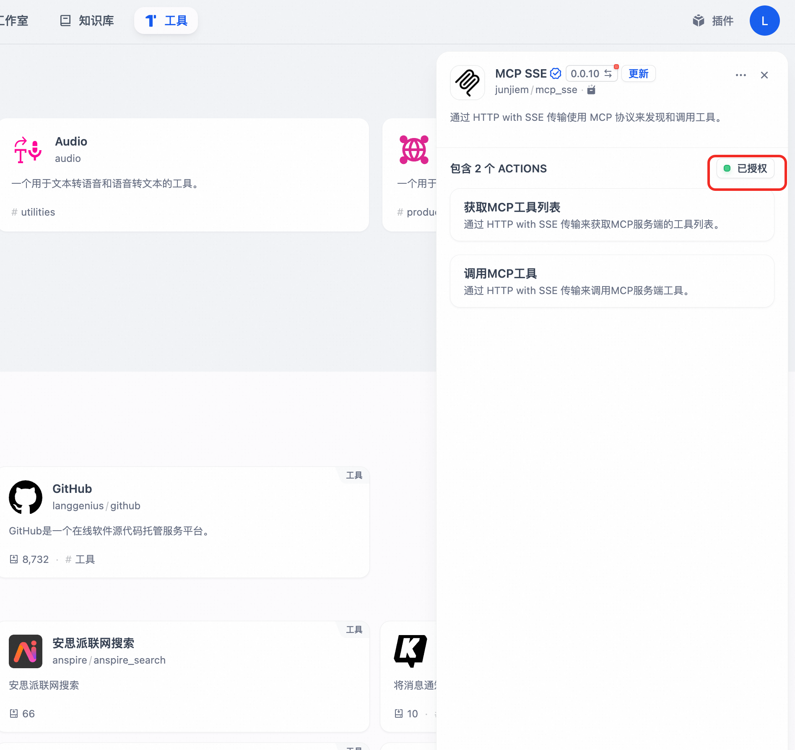
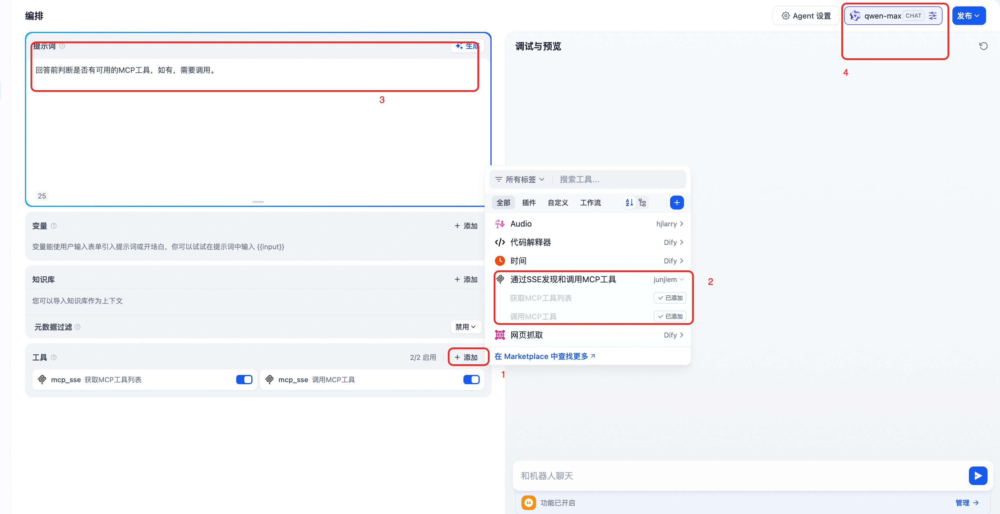

# Demo服务实例部署文档

## 概述

MCP（Model Context Protocol，模型上下文协议） ，2024年11月底，由 Anthropic 推出的一种开放标准，旨在统一大型语言模型（LLM）与外部数据源和工具之间的通信协议。MCP 的主要目的在于解决当前 AI 模型因数据孤岛限制而无法充分发挥潜力的难题，MCP 使得 AI 应用能够安全地访问和操作本地及远程数据，为 AI 应用提供了连接万物的接口。
本服务创造性地解决了传统MCP市场的以下问题：
1. 每次只能选择单个MCP工具进行部署。--本服务支持多选MCP工具同时部署
2. 不能同时兼容OpenAPI和SSE的方式调用工具，这导致只能适配部分平台。--本服务支持两种方式调用，支持Dify，Cherry Studio，OpenWebUI等AI助手。
3. 无法灵活增减要使用的MCP工具。--本服务支持通过变配动态增删要使用的MCP工具。

本文向您介绍如何开通计算巢上的`MCP Server社区版`服务，以及部署流程和使用说明。
## 前提条件
<font style="color:rgb(51, 51, 51);">部署Dify社区版服务实例，需要对部分阿里云资源进行访问和创建操作。因此您的账号需要包含如下资源的权限。</font><font style="color:rgb(51, 51, 51);"> </font>**<font style="color:rgb(51, 51, 51);">说明</font>**<font style="color:rgb(51, 51, 51);">：当您的账号是RAM账号时，才需要添加此权限。</font>

| <font style="color:rgb(51, 51, 51);">权限策略名称</font> | <font style="color:rgb(51, 51, 51);">备注</font> |
| --- | --- |
| <font style="color:rgb(51, 51, 51);">AliyunECSFullAccess</font> | <font style="color:rgb(51, 51, 51);">管理云服务器服务（ECS）的权限</font> |
| <font style="color:rgb(51, 51, 51);">AliyunVPCFullAccess</font> | <font style="color:rgb(51, 51, 51);">管理专有网络（VPC）的权限</font> |
| <font style="color:rgb(51, 51, 51);">AliyunROSFullAccess</font> | <font style="color:rgb(51, 51, 51);">管理资源编排服务（ROS）的权限</font> |
| <font style="color:rgb(51, 51, 51);">AliyunComputeNestUserFullAccess</font> | <font style="color:rgb(51, 51, 51);">管理计算巢服务（ComputeNest）的用户侧权限</font> |


MCP Server社区版在计算巢上的费用主要涉及：

- 所选vCPU与内存规格
- 系统盘类型及容量
- 公网带宽

为了提高MCP工具调用的性能，我们推荐至少选择2核，4G以上的CPU。
且默认帮您配置的网络带宽为10Mbps,按流量计费。

计费方式包括：

- 按量付费（小时）
- 包年包月


预估费用在创建实例时可实时看到。
如需更多规格、其他服务（如集群高可用性要求、企业级支持服务等），请联系我们 [mailto:xx@xx.com](mailto:xx@xx.com)。


## 部署架构


## 部署流程


### 部署参数说明

| <font style="color:rgb(51, 51, 51);">参数组</font>     | <font style="color:rgb(51, 51, 51);">参数项</font>         | <font style="color:rgb(51, 51, 51);">说明</font>                                            |
|-----------------------------------------------------|---------------------------------------------------------|-------------------------------------------------------------------------------------------|
| <font style="color:rgb(51, 51, 51);">MCP配置</font>   | <font style="color:rgb(51, 51, 51);">McpConfigJson</font>  | <font style="color:rgb(51, 51, 51);">需要使用的MCP工具</font>                                    |
|    | <font style="color:rgb(51, 51, 51);">MCP_KEY</font> | <font style="color:rgb(51, 51, 51);">MCP Server和大模型交互的秘钥</font>                           |
| <font style="color:rgb(51, 51, 51);">服务实例</font>    | <font style="color:rgb(51, 51, 51);">服务实例名称</font>      | <font style="color:rgb(51, 51, 51);">长度不超过64个字符，必须以英文字母开头，可包含数字、英文字母、短划线（-）和下划线（_）</font> |
|                                                     | <font style="color:rgb(51, 51, 51);">地域</font>          | <font style="color:rgb(51, 51, 51);">服务实例部署的地域</font>                                     |
|                                                     | <font style="color:rgb(51, 51, 51);">付费类型</font>        | <font style="color:rgb(51, 51, 51);">资源的计费类型：按量付费和包年包月</font>                             |
| <font style="color:rgb(51, 51, 51);">ECS实例配置</font> | <font style="color:rgb(51, 51, 51);">实例类型</font>        | <font style="color:rgb(51, 51, 51);">可用区下可以使用的实例规格</font>                                 |
|                                                     | <font style="color:rgb(51, 51, 51);">实例密码</font>        | <font style="color:rgb(51, 51, 51);">长度8-30，必须包含三项（大写字母、小写字母、数字、 ()`~!@#$%^&*-+=          |{}[]:;'<>,.?/ 中的特殊符号）</font> |
| <font style="color:rgb(51, 51, 51);">网络配置</font>    | <font style="color:rgb(51, 51, 51);">可用区</font>         | <font style="color:rgb(51, 51, 51);">ECS实例所在可用区</font>                                    |
|                                                     | <font style="color:rgb(51, 51, 51);">VPC ID</font>      | <font style="color:rgb(51, 51, 51);">资源所在VPC</font>                                       |
|                                                     | <font style="color:rgb(51, 51, 51);">交换机ID</font>       | <font style="color:rgb(51, 51, 51);">资源所在交换机</font>                                       |

### 部署步骤

1. 单击[部署链接]("https://computenest.console.aliyun.com/service/instance/create/default?type=user&ServiceName=MCP%20Server%E7%A4%BE%E5%8C%BA%E7%89%88")，进入服务实例部署界面，选择想部署的地域，根据界面提示，填写参数完成部署。
2. 选择你想使用的MCP工具。注意，可以多选哦！
3. 这里的MCP有两种类型。一种是无需环境变量的，比如"时间服务"，则直接勾选上，跳过参数配置步骤。
4. 另一种MCP类型需要环境变量，比如高德地图，则需要配置上环境变量，否则MCP Server会部署失败
3. 如果不清楚MCP工具怎么使用，可以点击查看"帮助文档"查看和学习。
5. 系统默认帮你生成了一个API KEY，用于保护你即将部署的MCP工具，你可以修改此参数。
6. 配置你的ECS实例规格，建议选择2核4G的规格以上。配置ECS登录密码
7. 对可用区和网络进行配置。推荐选择任意可用区后，直接新建网络和虚拟机
8. 点击立即创建，等待部署成功，该过程一般耗时3分钟。该时长根据您选择的工具的多少有所波动。
9. 访问刚部署成功的实例界面，可查看到您部署的专属MCP工具的地址和API秘钥。以下使用以Open WebUI为例，如需要查看Dify，Cherry Studio助手的引入，请参考下文
10. 打开您的AI助手客户端，如Open WebUI，并将地址和API秘钥粘贴进去。
11. 新建个对话，并开启MCP工具
12. 验证一下AI使用您的MCP工具！ 


### 修改要使用的MCP工具
如果想要修改要使用的MCP工具请参考下列操作
1. 在计算巢控制台，点击"我的实例"，选择之前部署的MCP Server实例，点击右上方的"修改配置"。
2. 点击修改MCP工具，并点击"下一步"
3. 选择想要新增的MCP工具，比如我这新增了Fetch工具。（注意：之前选择的工具在此处会被重新渲染）
4. 当然这里如果涉及到环境变量，则一定要按照文档进行设置。
5. 点击确定，发起工具修改请求。
6. 等待实例状态变更完。
7. 将输出中新增的MCP工具加入到AI对话客户端中。


## Cherry Studio使用示例
1. 来到计算巢实例界面，,接下来的操作需要使用"MCP Server访问地址"部分
2. 打开您的Cherry Studio助手，按照下图示例，新建MCP服务器。
3. "名称"和描述可以随便填。
4. 类型选择"服务器发送时间（sse)
5. URL填写实例界面的此处链接  注意此处使用的是http协议，结尾是sse后缀
6. 在请求头添加上鉴权参数：。注意此处需要将":"改为"="填入，比如Authorization=Bearer 123
7. 点击右上角的启用按钮和保存按钮。
8. 来到对话界面，选择要使用的MCP工具。
9. 选择合适的模型，与AI对话，比如"我现在在杭州云谷，请给我推荐开车半小时以内的餐馆",即可让AI调用模型帮你找到合适的餐馆。


## Dify 使用示例
1. 来到计算巢实例界面，,接下来的操作需要使用"MCP Server访问地址"部分
2. 打开您的Dify，按照下图示例，安装"SSE发现和调用MCP工具"
3. 如果后续使用出现问题，可将此工具版本降低到0.0.10。
4. 点击"授权"按钮对SSE工具进行配置。此处可直接粘贴步骤一中的MCP Server访问地址
5. 创建个Agent，并进入。
6. 按照下图示例，开启MCP工具调用，填写合适的提示词，选择合适的模型，比如QWEN-max。
7. 对话，即可调用MCP工具。

## 问题排查

如果发现实例一直未部署成功，90%的概率是环境变量配置错误，可参考以下步骤排查：
1. 通过会话管理登录到ECS实例。
2. 输入以下指令确认环境变量是否正确。
```shell
cat /root/config.json
```
4. 对配置进行修改。重启docker compose应用
```shell
sudo systemctl restart quickstart-mcp
```

请访问MCP官方了解如何使用：[使用文档](https://github.com/open-webui/mcpo)


